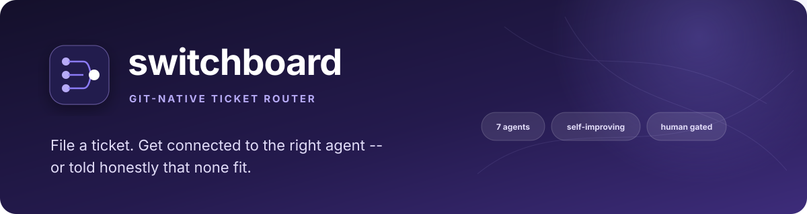
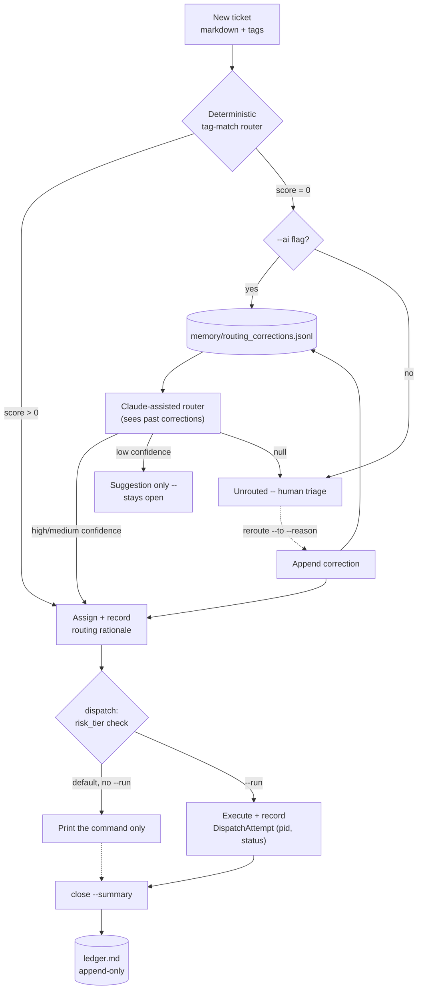

<p align="center">
  
</p>

<div align="center">

# switchboard

### A git-native ticket router for a fleet of specialist AI agents

File a ticket. Get connected to the right agent, automatically — or told honestly that none fit.

[](https://www.python.org/)
[](https://www.anthropic.com/)
[](LICENSE)
[](#whats-next)

</div>

---

<div align="center">

| 8 registered agents | 2 runtimes | 8 gaps closed vs. Livery | 41 tests |
|:---:|:---:|:---:|:---:|
| One markdown file each | Command string, or a live `claude_code` session | Routing · attempts · concurrency · Talk · Debate · Schedule (declare + install) · Notify | Fully offline, zero API key |

</div>

## Overview

Switchboard is a single-user, git-native ticket-and-dispatch layer for a
fleet of independent, single-purpose AI agents. It's inspired by
[Livery](https://github.com/sohailmamdani/livery)'s "agents and tickets
are files" model — built independently from scratch, no shared code — and
aimed at doing the one thing Livery leaves to a human: **deciding which
agent a ticket should go to**, automatically, better than a manually-set
`assignee` field can.

> **Related work in this portfolio:** [muster](https://github.com/PlainJane20/muster)
> and [taskloom](https://github.com/PlainJane20/taskloom) are two more
> independent takes on the same underlying interest, not a connected
> pipeline with this one — muster is the manual-assignment CLI baseline
> this repo adds automatic routing on top of (as an idea, not shared
> code); taskloom takes the visual-desktop-app angle instead.

### Why this exists

Manually deciding "which agent should handle this" doesn't scale past a
handful of agents, and asking an LLM every single time is slow and costs
money for decisions that are usually obvious. Switchboard's router is
deterministic by default (instant, free, tag-overlap matching), escalates
to Claude only when that's genuinely ambiguous, refuses to force a bad
match either way, and — the part that doesn't exist anywhere else in this
space — **remembers every time a human corrects it**, so the next
ambiguous ticket benefits from that correction as prompt context.

> **Why I built it:** this is a personal project, built to get real practice
> designing a deterministic-first, LLM-fallback decision system — the same
> shape shows up anywhere you need fast, free, auditable defaults with an
> escalation path for genuine ambiguity, not just agent routing. The
> correction-memory loop specifically was practice building feedback into a
> system rather than shipping a static ruleset once and walking away.

## Competencies demonstrated

| Competency | Observable evidence |
|---|---|
| Deterministic-first system design | Tag-overlap matching runs before any model call, so the common case is instant and free |
| Graceful escalation | Claude is only invoked when the deterministic pass is genuinely ambiguous, with an honest refusal path if nothing fits |
| Feedback-loop design | Every human correction (`reroute`) is recorded and fed back into the router's own prompt as ground truth |
| Independent implementation from a shared idea | Built from scratch against Livery's concept, no shared code — see [attribution](#how-this-compares-to-livery) |
| Honest self-assessment | The comparison table below states where this is ahead of Livery and where it's still behind, not just the flattering parts |

**Explore:** [vs. Livery](#how-this-compares-to-livery) · [How it works](#how-it-works) · [Architecture](#architecture) · [Real findings](#real-findings-from-building-and-testing-this) · [Setup](#setup) · [Usage](#usage)

---

## How this compares to Livery

Livery is a broader, more mature tool — this isn't a claim to have built
something bigger. It's narrower on purpose, and better than Livery
specifically at the one job it does:

| | Livery | Switchboard |
|---|---|---|
| **Agent-to-ticket assignment** | Manual — you set `assignee` yourself | **Automatic** — deterministic tag-match first, Claude-assisted fallback, honest refusal if nothing fits |
| **Learns from correction** | No feedback loop on assignment quality | **Yes** — every `reroute` is recorded and fed back into the AI router's prompt as ground truth |
| **Talk mode** (advisory Q&A) | Yes | **Yes** — `switchboard talk <agent-id> "question"` |
| **Walkie-Talkie** (AI-to-AI debate) | Two real hired agents, each in their own runtime | **Adapted** — two agent *personas* debate a ticket; honest about the difference below |
| **Scheduling** | `launchd`/`systemd` jobs, installed by the CLI | **Declared + rendered**, never auto-installed |
| **Notifications** | Telegram-specific | **Generic** — desktop notification plus any webhook (Slack, Discord, Telegram, plain HTTP) |
| **Routing rationale on the ticket** | Not applicable (no auto-routing) | Every routed ticket carries *why*, as permanent git-diffable history |
| **Live agent runtime** | 5 real adapters (Claude Code, Codex, Cursor, LM Studio, Ollama) | **One real adapter** (`claude -p`, verified against the installed CLI, not guessed) — narrower, but genuinely live, with real tool access |
| **Schedule installation** | Installs `launchd`/`systemd` jobs directly | **Yes, gated** — `schedule-install --apply` writes the real file and activates it; the bare command is a dry run |

The honest summary: Livery still has more runtime breadth (5 adapters vs.1) and a smaller safety gate on installing what it schedules. Everything
else in this table, Switchboard either matches or is ahead on — including now having *a* real live agent runtime, not just command strings, and
real (if explicitly gated) schedule installation.

---

## How it works

1. File a ticket — a markdown file with a title, tags, and a body, created via one CLI call
2. The **deterministic router** scores every registered agent by tag overlap and assigns the best match — no API call, no network
3. If no agent shares a single tag, the ticket stays **unrouted** unless you explicitly ask the **AI router** (Claude) — enriched with recent human corrections as few-shot context, and still allowed to say none of them fit
4. A **low-confidence** AI decision is recorded as a *suggestion*, not an assignment — the ticket stays open until a human commits to it
5. **`reroute`** lets a human override any decision, and permanently records why — that correction improves every future ambiguous routing call
6. **Dispatch** composes the exact shell command (or, for a `claude_code` agent, a live session prompt) that would send the ticket to its assigned agent, and prints it by default — `--run` executes it for real, with a durable attempt record and a warning for medium/high-risk agents
7. **Close** a ticket and it's appended to `ledger.md` — an append-only audit trail, never rewritten
8. **Talk** to any registered agent directly — no ticket filed, nothing dispatched
9. **Debate** a ticket between two agent personas when it's genuinely unclear whose job it is
10. **Schedule** a recurring dispatch declaratively, render it into a real `launchd`/`systemd` unit, and optionally **install** it for real — gated behind an explicit `--apply`, never a side effect of anything else
11. Get **notified** — desktop notification or webhook — the moment a ticket needs a human or a dispatch fails

## Architecture



Full agent-by-agent, decision-by-decision design rationale — including a
line-by-line comparison against Livery's actual documented behavior — is
in [ARCHITECTURE.md](ARCHITECTURE.md).

---

## Real findings from building and testing this

| Finding | What changed |
|---|---|
| A router that always answers trains you to stop checking the answer | `route_deterministic` returns `None` below a real tag match instead of always producing its highest-scoring guess |
| Confidence has to gate the action, not just get logged next to it | Only medium/high AI confidence commits an assignment; low confidence is a recorded suggestion, ticket stays open |
| A fire-and-forget `subprocess.run` is a real robustness gap | `--run` now uses `Popen` (PID captured at start) through to a `DispatchAttempt` record — proven against a real failure, not mocked (see below) |
| Concurrent ticket creation needs an actual lock | `O_CREAT\|O_EXCL` advisory lock around id allocation; a 10-thread test proves it |
| Not every repo fits the same abstraction | Three real repos deliberately excluded from the agent registry — forcing them in would look complete while being wrong |
| A "verified" adapter that only works under one auth setup isn't verified | `--bare` mode (the obvious default for scripted `claude` calls) fails outright on this machine — managed/enterprise settings pin first-party OAuth login, which `--bare` explicitly disables. The adapter doesn't use it. |
| Installing into `~/Library/LaunchAgents` is a different category of action than dispatching an agent | `schedule-install` is a dry run by default even though `schedule-render` already existed — an extra explicit gate, on top of the one every other real action already has |

The dispatch-attempt claim, proven, not asserted — dispatching a ticket to
an agent whose repo isn't cloned locally correctly recorded a failure
instead of a silent hang:

```json
{
  "id": "0002-20260831T193217",
  "ticket_id": "0002",
  "agent_id": "tpm-agent-os",
  "pid": 70794,
  "status": "failed",
  "returncode": 2
}
```

And the live `claude_code` runtime claim, proven the same way — ticket
0006 dispatched for real to `research-assistant`, which read
`ARCHITECTURE.md` with its `Read` tool and answered correctly, with a real
session id and real cost tracked:

```json
{
  "id": "0006-20260831T205910",
  "ticket_id": "0006",
  "agent_id": "research-assistant",
  "status": "succeeded",
  "returncode": 0,
  "session_id": "06f277f3-da9d-451d-bcee-7b2619e09baf",
  "cost_usd": 0.15030852000000003
}
```

---

## What's next

- [x] Automatic routing (deterministic + AI fallback)
- [x] Routing-correction memory
- [x] Durable dispatch attempts
- [x] Concurrency-safe ticket creation
- [x] Talk mode
- [x] Walkie-Talkie-style debate (persona-adapted)
- [x] Scheduling (declared, rendered, and installable)
- [x] Generic notifications (desktop + webhook)
- [x] A real, live runtime adapter (`claude_code`) — verified against the actual CLI, proven with a real dispatch
- [x] Schedule installation — gated behind `--apply`, never automatic
- [ ] Runtime breadth beyond Claude Code — Codex, Cursor, LM Studio, Ollama would each need their own verified adapter; one real one beats four guessed ones
- [ ] Cron beyond "fixed time(s), daily" — anything else raises a clear error instead of guessing

## Setup

```bash
python3 -m venv .venv
source .venv/bin/activate
pip install -e ".[dev]"      # installs the real `switchboard` command
cp .env.example .env          # only needed for `route --ai` and `talk`
pytest tests/ -v              # fully offline, no API key required
```

## Usage

```bash
# Starting from scratch? Scaffold agents/, tickets/, memory/
switchboard init

# See what's registered
switchboard agents

# File a ticket
switchboard new --title "Clean up Gmail before the demo" \
  --tags "email,cleanup" --body "Archive spam, leave receipts labeled."

# Route it -- deterministic tag-match, no API call, rationale persisted on the ticket
switchboard route 0001

# No tag overlap with anything registered? Ask Claude -- it sees past corrections too.
switchboard route 0005 --ai

# Disagree with a routing call? Override it, and teach the router why.
switchboard reroute 0005 --to exec-status-rollup --reason "..."

# See the exact command that would run -- prints by default, doesn't execute
switchboard dispatch 0001

# Actually run it -- tracked as a durable attempt (pid, status, exit code)
switchboard dispatch 0001 --run
switchboard attempts 0001

# Full ticket detail: routing rationale + every dispatch attempt
switchboard show 0001

# Advisory question to an agent -- no ticket filed, nothing dispatched
switchboard talk inbox-marshal "Would you touch an email that's already labeled by Gmail's own filters?"

# Genuinely unclear whether it's one agent's job? Have two argue about it.
switchboard debate 0005 --agent-a exec-status-rollup --agent-b critical-path-radar --rounds 2

# Declare a recurring schedule -- nothing installed yet
switchboard schedule-new --id daily-exec-rollup \
  --description "Morning executive portfolio rollup" \
  --agent exec-status-rollup --cron "0 8 * * *"

# Render it as a real launchd plist (macOS) or systemd unit (Linux) -- prints only
switchboard schedule-render daily-exec-rollup

# Preview exactly what installing it would write and where -- still nothing written
switchboard schedule-install daily-exec-rollup

# Actually write it and activate it (launchctl load / systemctl enable --now)
switchboard schedule-install daily-exec-rollup --apply
switchboard schedule-uninstall daily-exec-rollup --apply    # and to remove it again

# Dispatch to a live claude_code agent -- real tool access, not a canned script
switchboard new --title "Summarize a doc" --tags "research" --body "..."
switchboard route 0007
switchboard dispatch 0007 --run

# Close it out -- appended to ledger.md, never rewritten
switchboard close 0001 --summary "Inbox clean, demo-ready."

# Full board, grouped by status
switchboard board
```

Set `SWITCHBOARD_WEBHOOK_URL` to any endpoint that accepts a JSON
`{"text": "..."}` POST (a Slack incoming webhook, Discord, or your own) to
get notified when a ticket needs triage or a dispatch fails. macOS also
gets a local desktop notification automatically, no configuration needed.

The repository ships with a real, already-populated board — six tickets
spanning open, routed, in-progress, and done, including one that was
deliberately unrouted by the deterministic pass and then manually
corrected with `reroute` (now in `memory/routing_corrections.jsonl` for
the AI router to learn from), and one (0006) that was actually dispatched
to the live `claude_code` runtime and closed with a real result.

---

## Repository map

```text
switchboard/
├── switchboard/                 The package
│   ├── models.py                AgentEntry, Ticket, RoutingRationale, Correction, DispatchAttempt
│   ├── frontmatter.py           Minimal YAML-frontmatter markdown parsing
│   ├── registry.py              Loads agents/*.md
│   ├── tickets.py                Create/list/update/close tickets; lock-guarded id allocation; append-only ledger
│   ├── router.py                Deterministic tag-match + Claude-assisted fallback, correction-aware
│   ├── memory.py                Append-only routing-correction log the AI router reads back
│   ├── attempts.py               Durable dispatch attempt records (PID, status, exit code)
│   ├── talk.py                   Advisory Q&A with an agent -- no ticket, no dispatch
│   ├── debate.py                 Walkie-Talkie-style two-agent-persona debate
│   ├── schedule.py               Declare, render, and (gated by --apply) install recurring dispatches
│   ├── notify.py                 Best-effort desktop + webhook notifications, never raises
│   ├── claude_runtime.py         The one real live-agent adapter -- `claude -p`, verified against the installed CLI
│   ├── dispatch.py               Composes and (optionally) runs the invoke command, or a live claude_code session
│   └── cli.py                    `switchboard <command>`
├── agents/                       Eight real specialist agents, one file each (one runs live)
├── tickets/                      A live, populated example board
├── memory/routing_corrections.jsonl   Git-tracked correction history
├── talk/                         Per-agent advisory transcripts (created on first use)
├── walkie-talkie/                Debate transcripts (created on first use)
├── schedules/                    Declared recurring dispatches, one file each
├── ledger.md                     Append-only record of closed tickets
├── tests/                        Fully offline (SWITCHBOARD_MOCK=1 for the AI router)
└── ARCHITECTURE.md               Design rationale, decision by decision
```

---

## Contact

<div align="center">

### Navi Sohi

*Technical Program Manager & Automation Engineer*

<a href="https://www.linkedin.com/in/navisohi/"></a>
<a href="https://github.com/PlainJane20"></a>
<a href="mailto:nks.ai.dev@gmail.com"></a>

</div>

## License

Copyright © 2026 Navi Sohi.

This project is distributed under the [MIT License](LICENSE). Reuse is permitted under the
license terms, provided the copyright and license notice are retained in copies or substantial
portions of the software.
