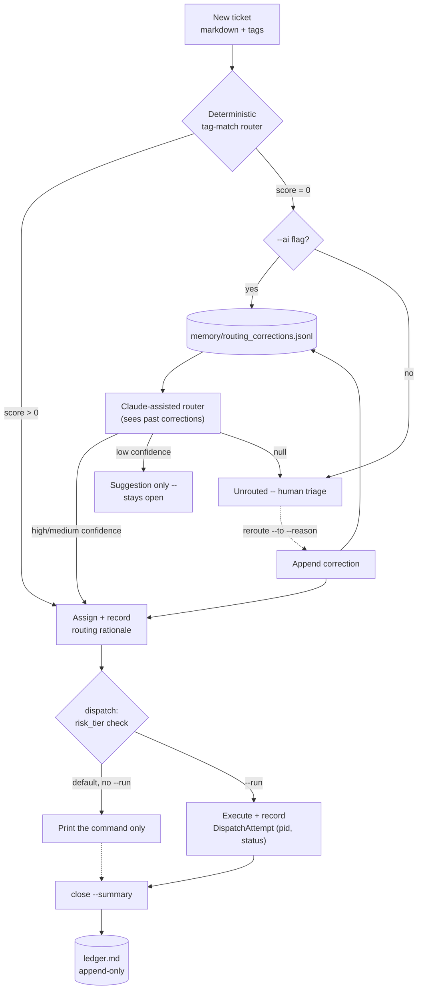

# switchboard

## A Git-Native Ticket Router for a Fleet of Specialist AI Agents

> **File a ticket. Get connected to the right agent — or told honestly that none fit.**

<div align="center">

[](https://www.python.org/)
[](https://www.anthropic.com/)
[]()
[]()
[](LICENSE)

</div>

A single-user, git-native ticket-and-dispatch layer that routes work
across a fleet of independent, single-purpose AI agents. Inspired by
[Livery](https://github.com/sohailmamdani/livery)'s "agents and tickets
are files" model, built independently from scratch (no shared code — see
[ARCHITECTURE.md](ARCHITECTURE.md) for the full comparison), and aimed at
doing the one thing Livery leaves to a human — *deciding which agent a
ticket should go to* — better than a manually-set `assignee` field can.

**Explore:** [Why](#why-this-exists) · [vs. Livery](#how-this-compares-to-livery) · [How it works](#how-it-works) · [Architecture](#architecture) · [Real findings](#real-findings-from-building-and-testing-this) · [Setup](#setup) · [Usage](#usage)

## Why this exists

Manually deciding "which agent should handle this" doesn't scale past a
handful of agents, and asking an LLM every single time is slow and costs
money for decisions that are usually obvious. Switchboard's router is
deterministic by default (instant, free, tag-overlap matching), escalates
to Claude only when that's genuinely ambiguous, refuses to force a bad
match either way, and — the part that doesn't exist anywhere else in this
space — **remembers every time a human corrects it**, so the next
ambiguous ticket benefits from that correction as prompt context.

## How this compares to Livery

Livery is a broader, more mature tool — this isn't a claim to have built
something bigger. It's narrower on purpose, and better than Livery
specifically at the one job it does:

| | Livery | Switchboard |
|---|---|---|
| **Agent-to-ticket assignment** | Manual — you set `assignee` yourself | **Automatic**: deterministic tag-match first, Claude-assisted fallback, honest refusal if nothing fits |
| **Learns from correction** | No feedback loop on assignment quality | **Yes** — every `reroute` is recorded and fed back into the AI router's prompt as ground truth |
| **Runtime breadth** | 5 adapters (Claude Code, Codex, Cursor, LM Studio, Ollama) | Shells out to any command string — less abstraction, but zero adapter code to maintain |
| **Execution tracking** | Durable attempt records (PID, status, hooks) | Durable attempt records (PID, status, exit code) — same idea, independently built |
| **Talk mode** (advisory Q&a, no ticket/dispatch) | Yes | **Yes** — `switchboard talk <agent-id> "question"`, append-only transcript per agent |
| **Scheduling, Walkie-Talkie, Telegram** | Yes | Not yet — see [What's next](#whats-next) |
| **Routing rationale on the ticket itself** | Not applicable (no auto-routing) | Every routed ticket carries *why* — method, matched tags or AI justification, confidence — as permanent, git-diffable history |

The honest summary: Livery is the better platform if you need scheduling,
multi-runtime support, or conversational agent modes. Switchboard is the
better *router* — because routing, specifically, is the whole product.

## How it works

1. File a ticket — a markdown file with a title, tags, and a body, created via one CLI call
2. The **deterministic router** scores every registered agent by tag overlap and assigns the best match — no API call, no network
3. If no agent shares a single tag, the ticket stays **unrouted** unless you explicitly ask the **AI router** (Claude) to make a judgment call — enriched with recent human corrections as few-shot context, and still allowed to say none of them fit
4. A **low-confidence** AI decision is recorded as a *suggestion*, not an assignment — the ticket stays open until a human commits to it
5. **`reroute`** lets a human override any decision, and permanently records why — that correction improves every future ambiguous routing call
6. **Dispatch** composes the exact shell command that would send the ticket to its assigned agent, and prints it by default — `--run` executes it for real, with a durable attempt record (PID, status, exit code) and a visible warning for medium/high-risk agents
7. **Close** a ticket and it's appended to `ledger.md` — an append-only audit trail, never rewritten
8. **Talk** to any registered agent directly — "would you actually handle this?" — without filing a ticket or running anything; the exchange is appended to a per-agent transcript

## Architecture



Full agent-by-agent, decision-by-decision design rationale — including a
line-by-line comparison against Livery's actual documented behavior — is
in [ARCHITECTURE.md](ARCHITECTURE.md).

## Real findings from building and testing this

- **A router that always answers trains you to stop checking the answer.**
  The deterministic router returns `None` below a real tag match rather
  than always producing its highest-scoring guess — otherwise "unrouted"
  stops meaning anything. `test_deterministic_router_refuses_to_force_a_bad_match`
  guards this.
- **Confidence has to gate the action, not just get logged next to it.**
  An earlier version auto-assigned on *any* AI decision with a non-null
  agent id, regardless of confidence. That's backwards — a low-confidence
  guess auto-assigned looks identical to a high-confidence one on the
  board. Now only medium/high confidence commits; low confidence is
  recorded as a suggestion and the ticket stays open.
- **A fire-and-forget `subprocess.run` is a real robustness gap, not a
  nitpick.** `--run` now uses `Popen` so the PID is captured the instant
  the process starts, tracked through to exit status in a `DispatchAttempt`
  record. Proven against a real failure during testing — dispatching a
  ticket to an agent whose repo isn't cloned locally correctly recorded
  `status: failed, returncode: 2`, not a silent hang:
  ```json
  {
    "id": "0002-20260831T193217",
    "ticket_id": "0002",
    "agent_id": "tpm-agent-os",
    "command": "python run_demo.py tickets/0002-frame-the-async-triage-unification-progr.md",
    "pid": 70794,
    "status": "failed",
    "returncode": 2
  }
  ```
- **Concurrent ticket creation needs an actual lock, not "probably fine."**
  Two threads reading the same "next id" before either writes will
  silently produce two tickets that collide on one filename. An
  `O_CREAT|O_EXCL`-based advisory lock around id allocation closes this;
  `test_concurrent_ticket_creation_never_collides` fires ten ticket
  creations at once and asserts all ten ids are unique.
- **Not every repo fits the same abstraction, and forcing it is worse than
  leaving it out.** Three real repos were deliberately excluded from the
  agent registry because they don't fit "dispatch a ticket to it" — see
  ARCHITECTURE.md for which ones and why.

## What's next

The features Livery has that Switchboard deliberately doesn't yet:

- **Scheduling** — a `schedules/` directory of declared cadences, the
  same portable-markdown approach used for tickets and agents.
- **Notifications** — a lightweight local notification (or webhook) when
  a ticket lands in "needs triage" or a dispatch attempt fails.
- **Walkie-Talkie** — structured AI-to-AI debate between two registered
  agents on a ticket, rather than one agent's opinion via Talk.

## Setup

```bash
python3 -m venv .venv
source .venv/bin/activate
pip install -e ".[dev]"     # installs the real `switchboard` command
cp .env.example .env         # only needed for `route --ai` and `talk`
pytest tests/ -v             # fully offline, no API key required
```

## Usage

```bash
# Starting from scratch? Scaffold agents/, tickets/, memory/
switchboard init

# See what's registered
switchboard agents

# File a ticket
switchboard new --title "Clean up Gmail before the demo" \
  --tags "email,cleanup" --body "Archive spam, leave receipts labeled."

# Route it -- deterministic tag-match, no API call, rationale persisted on the ticket
switchboard route 0001

# No tag overlap with anything registered? Ask Claude -- it sees past corrections too.
switchboard route 0005 --ai

# Disagree with a routing call? Override it, and teach the router why.
switchboard reroute 0005 --to exec-status-rollup --reason "..."

# See the exact command that would run -- prints by default, doesn't execute
switchboard dispatch 0001

# Actually run it -- tracked as a durable attempt (pid, status, exit code)
switchboard dispatch 0001 --run
switchboard attempts 0001

# Full ticket detail: routing rationale + every dispatch attempt
switchboard show 0001

# Advisory question to an agent -- no ticket filed, nothing dispatched
switchboard talk inbox-marshal "Would you touch an email that's already labeled by Gmail's own filters?"

# Close it out -- appended to ledger.md, never rewritten
switchboard close 0001 --summary "Inbox clean, demo-ready."

# Full board, grouped by status
switchboard board
```

The repository ships with a real, already-populated board — five tickets
spanning open, routed, in-progress, and done, including one that was
deliberately unrouted by the deterministic pass and then manually
corrected with `reroute`, which is now in `memory/routing_corrections.jsonl`
for the AI router to learn from on the next ambiguous ticket.

## Repository map

```text
switchboard/
├── switchboard/                 The package
│   ├── models.py                AgentEntry, Ticket, RoutingRationale, Correction, DispatchAttempt
│   ├── frontmatter.py           Minimal YAML-frontmatter markdown parsing
│   ├── registry.py              Loads agents/*.md
│   ├── tickets.py                Create/list/update/close tickets; lock-guarded id allocation; append-only ledger
│   ├── router.py                Deterministic tag-match + Claude-assisted fallback, correction-aware
│   ├── memory.py                Append-only routing-correction log the AI router reads back
│   ├── attempts.py               Durable dispatch attempt records (PID, status, exit code)
│   ├── talk.py                   Advisory Q&A with an agent -- no ticket, no dispatch
│   ├── dispatch.py               Composes and (optionally) runs the invoke command
│   └── cli.py                    `switchboard <command>`
├── agents/                       Seven real specialist agents, one file each
├── tickets/                      A live, populated example board
├── memory/routing_corrections.jsonl   Git-tracked correction history
├── talk/                         Per-agent advisory transcripts (created on first use)
├── ledger.md                     Append-only record of closed tickets
├── tests/                        Fully offline (SWITCHBOARD_MOCK=1 for the AI router)
└── ARCHITECTURE.md               Design rationale, decision by decision
```

## License

MIT — see [LICENSE](LICENSE).
