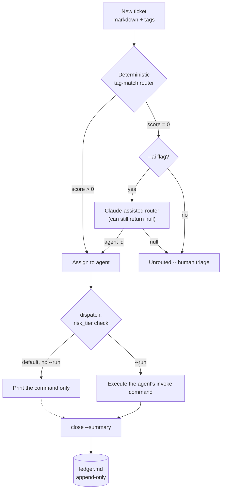

# switchboard

## A Git-Native Ticket Router for a Fleet of Specialist AI Agents

> **File a ticket. Get connected to the right agent — or told honestly that none fit.**

<div align="center">

[](https://www.python.org/)
[](https://www.anthropic.com/)
[]()
[]()
[](LICENSE)

</div>

A single-user, git-native ticket-and-dispatch layer that routes work across
a fleet of independent, single-purpose AI agents — inspired by
[Livery](https://github.com/sohailmamdani/livery)'s "agents and tickets are
files" model, scoped down to one job: given a ticket, pick the best-fit
registered specialist, or say honestly that none fit.

**Explore:** [Competencies](#competencies-demonstrated) · [How it works](#how-it-works) · [Architecture](#architecture) · [Real findings](#real-findings-from-building-and-testing-this) · [Setup](#setup) · [Usage](#usage) · [Repository map](#repository-map)

## Why this exists

Nine single-purpose agents in this portfolio each do one job well —
cleaning a Gmail inbox, drafting a blameless postmortem, reviewing a spec
across five lenses, computing a critical path. None of them knew the
others existed. That's fine for a demo of any one agent; it's not an
operating model. Switchboard is the layer that turns "nine separate
scripts" into "a fleet you can file a ticket against."

## Competencies demonstrated

| Capability | Competency it demonstrates |
|---|---|
| Deterministic tag-match routing, AI only as a fallback | Resource allocation judgment — spend the expensive path only when the cheap one can't decide |
| Refuses to force a match on zero tag overlap | Honest escalation — an unclear ticket surfaces for a human instead of being silently mis-assigned |
| Declarative agent registry (one markdown file per agent) | An operating model that scales by adding agents, not by rewriting the router |
| Risk-tiered dispatch (prints by default; `--run` is opt-in) | Governance judgment — distinguishing read-only analysis from real side effects before automating either |
| Git-native tickets + an append-only ledger | An auditable operating rhythm — every routing and closing decision is inspectable history, not a database row nobody reads |
| Three real repos deliberately excluded from the registry | Judgment about system boundaries — knowing what *not* to force into an abstraction |

## How it works

1. File a ticket — a markdown file with a title, tags, and a body, created via one CLI call
2. The **deterministic router** scores every registered agent by tag overlap and assigns the best match — no API call, no network
3. If no agent shares a single tag, the ticket stays **unrouted** unless you explicitly ask the **AI router** (Claude) to make a judgment call — and it's allowed to say none of them fit, too
4. **Dispatch** composes the exact shell command that would send the ticket to its assigned agent, and prints it — running it for real is an explicit `--run` flag, with a visible warning for medium/high-risk agents
5. **Close** a ticket and it's appended to `ledger.md` — an append-only audit trail, never rewritten

## Architecture



Full agent-by-agent, decision-by-decision design rationale — including why
three real repos are deliberately *not* in the registry — is in
[ARCHITECTURE.md](ARCHITECTURE.md).

## Real findings from building and testing this

- **A router that always answers trains you to stop checking the answer.**
  An early version of the deterministic router always returned its
  highest-scoring agent, even at a tag-overlap score of zero. Adding a
  floor — return `None` below a real match — is what makes "unrouted" a
  meaningful, trustworthy signal instead of a router that's always
  confidently wrong on the tickets it can't actually handle.
  `test_deterministic_router_refuses_to_force_a_bad_match` exists to keep
  this from regressing.
- **A private helper leaking across a module boundary is a real bug, not
  a style nitpick.** `cli.py` originally reached into `tickets._path_for`
  — a leading-underscore "private" function — because nothing public
  exposed the same lookup. Renaming it to `tickets.path_for` and updating
  every call site turned an implicit contract into an explicit one.
- **Not every repo fits the same abstraction, and forcing it is worse than
  leaving it out.** `agent-control-tower` (governs other agents, isn't a
  task-doer), `signalweave-ai` (expects a structured scenario object, not
  a freeform ticket), and `pm-automation-system` (a standing service, not
  a one-shot process) all failed the "does a ticket dispatch to this"
  test. Seven honestly-described agents beat ten where three are guesses.
- **Mocking the whole CLI hides which parts actually need it.**
  `SWITCHBOARD_MOCK` only short-circuits `route_with_ai` — the single
  function that calls Claude. Every other command already works with zero
  network dependency, and a blanket mock mode would have obscured that.

## Setup

```bash
python3 -m venv .venv
source .venv/bin/activate
pip install -r requirements.txt
cp .env.example .env   # only needed for `route --ai`
pytest tests/ -v       # fully offline, no API key required
```

## Usage

```bash
# See what's registered
python -m switchboard agents

# File a ticket
python -m switchboard new --title "Clean up Gmail before the demo" \
  --tags "email,cleanup" --body "Archive spam, leave receipts labeled."

# Route it -- deterministic tag-match, no API call
python -m switchboard route 0001

# No tag overlap with anything registered? Ask Claude, or leave it for a human.
python -m switchboard route 0005 --ai

# See the exact command that would run -- prints by default, doesn't execute
python -m switchboard dispatch 0001

# Actually run it (medium/high-risk agents print a warning first)
python -m switchboard dispatch 0001 --run

# Close it out -- appended to ledger.md, never rewritten
python -m switchboard close 0001 --summary "Inbox clean, demo-ready."

# Full board, grouped by status
python -m switchboard board
```

The repository ships with a real, already-populated board — five tickets
spanning open, routed, in-progress, and done, including one deliberately
left unrouted because nothing registered actually fits it. `board` shows
it as soon as you clone.

## Repository map

```text
switchboard/
├── switchboard/            The package
│   ├── models.py           AgentEntry, Ticket, RouteDecision (Pydantic)
│   ├── frontmatter.py      Minimal YAML-frontmatter markdown parsing
│   ├── registry.py         Loads agents/*.md
│   ├── tickets.py          Create/list/update/close tickets; append-only ledger
│   ├── router.py           Deterministic tag-match + Claude-assisted fallback
│   ├── dispatch.py         Composes (and optionally runs) the invoke command
│   └── cli.py              `python -m switchboard <command>`
├── agents/                 Seven real specialist agents, one file each
├── tickets/                A live, populated example board
├── ledger.md               Append-only record of closed tickets
├── tests/                  Fully offline (SWITCHBOARD_MOCK=1 for the AI router)
└── ARCHITECTURE.md         Design rationale, decision by decision
```

## Contact

<div align="center">

### **Navi Sohi**
*Technical Program Manager & Automation Engineer*

<br>

[](https://www.linkedin.com/in/navisohi/)
[](https://github.com/PlainJane20)
[](https://mail.google.com/mail/?view=cm&fs=1&to=nks.ai.dev@gmail.com)

<br>

</div>

## License

MIT — see [LICENSE](LICENSE).
